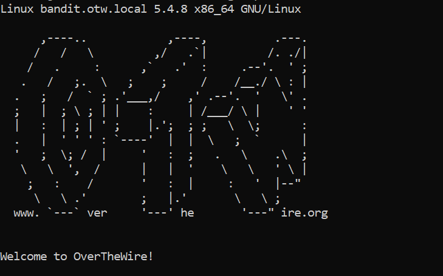

# OverTheWire (Bandit)

## _**Level 0**_

.png>)

Based on [https://www.wikihow.com/Use-SSH](https://www.wikihow.com/Use-SSH), the command is:

`ssh bandit0@bandit.labs.overthewire.org -p 2220`

And the password is `bandit0`. If successful, it will display:

## _**Level 0 → Level 1**_

The password for the next level is stored in a file called **readme** located in the home directory.

Use `ls` command to list the files, and `cat` command to read the data in file which is password for Level 1.

.png>)

## _**Level 1 → Level 2**_

The password for the next level is stored in a file called **-** located in the home directory.

Use `ls` command to list the files.

Use `./-` command to open **"dashed filename ( - )"** which is `cat ./-` _****_ to get the password for Level 2.

.png>)

## _**Level 2 → Level 3**_

The password for the next level is stored in a file called **spaces in this filename** located in the home directory.

Use `ls` command to list the files.

Use `'spaces in this filename'` command to open **"dashed filename ( - )"** which is `cat 'spaces in this filename'` _****_ to get the password for Level 3.

.png>)

## _**Level 3 → Level 4**_

The password for the next level is stored in a hidden file in the **inhere** directory.

Use `ls` command to list the files , `-a` option to list ALL the files in **inhere** directory

`ls -a inhere` and it shows `.hidden` filename.

Use `cd inhere/` to change directory into **inhere** and **** `cat .hidden` **** to read the hidden file to get the password for Level 4.

.png>)

## _**Level 4 → Level 5**_

