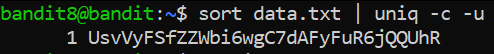

# OverTheWire (Bandit)

_**Level 0**_

Based on [https://www.wikihow.com/Use-SSH](https://www.wikihow.com/Use-SSH), the command is:

`ssh bandit0@bandit.labs.overthewire.org -p 2220`

And the password is `bandit0`
